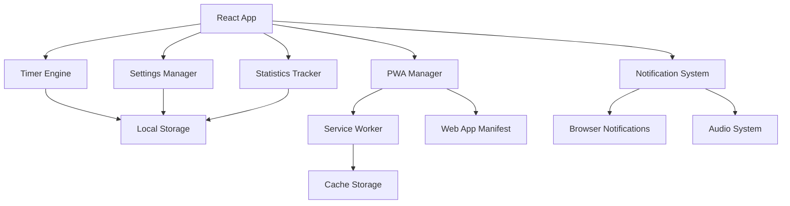
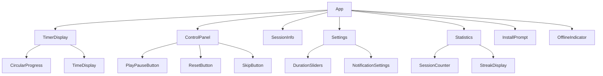

# Design Document

## Overview

The Pomodoro PWA will be built as a React-based Progressive Web App that provides a complete Pomodoro Technique implementation. The application will feature a clean, minimalist interface with a central timer display, intuitive controls, and comprehensive PWA capabilities including offline functionality and device installation.

The app will use a single-page application architecture with React hooks for state management, local storage for data persistence, and service workers for offline capabilities. The design emphasizes simplicity and focus, with distinct visual states for work and break sessions.

## Architecture

### High-Level Architecture



### Component Architecture



## Components and Interfaces

### Core Components

#### 1. TimerDisplay Component
- **Purpose**: Central timer visualization with circular progress and time display
- **Props**: `timeRemaining`, `totalTime`, `isRunning`, `sessionType`
- **Features**: 
  - Circular progress ring that depletes as time passes
  - Large, readable time display in MM:SS format
  - Color-coded based on session type (work/break)
  - Smooth animations for state transitions

#### 2. ControlPanel Component
- **Purpose**: Primary user controls for timer management
- **Props**: `onStart`, `onPause`, `onReset`, `onSkip`, `timerState`
- **Features**:
  - Play/Pause toggle button with icon transitions
  - Reset button with confirmation for active sessions
  - Skip button for breaks (hidden during work sessions)
  - Responsive button sizing and touch-friendly targets

#### 3. SessionInfo Component
- **Purpose**: Display current session information and progress
- **Props**: `sessionType`, `sessionCount`, `cycleProgress`
- **Features**:
  - Session type indicator (Work/Short Break/Long Break)
  - Current session number in the cycle
  - Visual progress through the 4-session cycle

#### 4. Settings Component
- **Purpose**: Configuration interface for timer durations and preferences
- **Props**: `settings`, `onSettingsChange`
- **Features**:
  - Slider controls for work, short break, and long break durations
  - Toggle switches for sound and notification preferences
  - Real-time preview of changes
  - Reset to defaults option

#### 5. Statistics Component
- **Purpose**: Display productivity metrics and session history
- **Props**: `dailySessions`, `streak`, `totalSessions`
- **Features**:
  - Today's completed sessions counter
  - Current streak display
  - Simple charts for weekly/monthly trends
  - Achievement badges for milestones

### Service Interfaces

#### TimerService
```typescript
interface TimerService {
  start(): void;
  pause(): void;
  reset(): void;
  skip(): void;
  getCurrentTime(): number;
  getSessionType(): SessionType;
  onTick(callback: (time: number) => void): void;
  onComplete(callback: (sessionType: SessionType) => void): void;
}
```

#### SettingsService
```typescript
interface SettingsService {
  getSettings(): Settings;
  updateSettings(settings: Partial<Settings>): void;
  resetToDefaults(): void;
  onSettingsChange(callback: (settings: Settings) => void): void;
}
```

#### StatisticsService
```typescript
interface StatisticsService {
  recordSession(sessionType: SessionType): void;
  getDailyStats(): DailyStats;
  getStreak(): number;
  getTotalSessions(): number;
}
```

#### NotificationService
```typescript
interface NotificationService {
  requestPermission(): Promise<boolean>;
  showNotification(title: string, body: string): void;
  playSound(soundType: SoundType): void;
  isSupported(): boolean;
}
```

## Data Models

### Settings Model
```typescript
interface Settings {
  workDuration: number; // minutes (5-60)
  shortBreakDuration: number; // minutes (1-15)
  longBreakDuration: number; // minutes (5-30)
  soundEnabled: boolean;
  notificationsEnabled: boolean;
  autoStartBreaks: boolean;
  autoStartWork: boolean;
}
```

### Session Model
```typescript
interface Session {
  id: string;
  type: SessionType;
  startTime: Date;
  endTime: Date;
  completed: boolean;
  duration: number; // actual duration in minutes
}

enum SessionType {
  WORK = 'work',
  SHORT_BREAK = 'short_break',
  LONG_BREAK = 'long_break'
}
```

### Statistics Model
```typescript
interface DailyStats {
  date: string;
  completedSessions: number;
  workMinutes: number;
  breakMinutes: number;
}

interface UserStats {
  totalSessions: number;
  currentStreak: number;
  longestStreak: number;
  dailyStats: DailyStats[];
}
```

### Timer State Model
```typescript
interface TimerState {
  isRunning: boolean;
  isPaused: boolean;
  currentTime: number; // seconds remaining
  totalTime: number; // total session duration in seconds
  sessionType: SessionType;
  sessionCount: number; // current session in cycle (1-4)
  cycleCount: number; // completed cycles
}
```

## Error Handling

### Timer Errors
- **Background Tab Throttling**: Use Web Workers or Page Visibility API to maintain accuracy
- **Audio Playback Failures**: Graceful fallback to visual notifications only
- **Permission Denied**: Clear user feedback and alternative notification methods

### Storage Errors
- **LocalStorage Full**: Implement data cleanup and user notification
- **Storage Access Denied**: Fallback to in-memory storage with session persistence warning
- **Data Corruption**: Reset to defaults with user confirmation

### PWA Errors
- **Service Worker Registration Failure**: App continues to work without offline capabilities
- **Cache Storage Errors**: Fallback to network-only mode
- **Manifest Parsing Errors**: Log errors but don't break core functionality

### Network Errors
- **Offline Detection**: Show offline indicator and disable network-dependent features
- **Service Worker Update Failures**: Retry mechanism with exponential backoff

## Testing Strategy

### Unit Testing
- **Timer Logic**: Test all timer states, transitions, and edge cases
- **Settings Management**: Validate input ranges and persistence
- **Statistics Calculations**: Verify accuracy of counters and streaks
- **Notification System**: Mock browser APIs and test fallbacks

### Integration Testing
- **Component Interactions**: Test timer controls with display updates
- **Service Integration**: Verify data flow between services and components
- **Storage Integration**: Test persistence across browser sessions
- **PWA Features**: Test service worker registration and caching

### End-to-End Testing
- **Complete Pomodoro Cycles**: Automated tests for full work/break cycles
- **Settings Persistence**: Verify settings survive app restarts
- **Offline Functionality**: Test app behavior without network
- **Installation Flow**: Test PWA installation on different devices

### PWA Testing
- **Lighthouse Audits**: Ensure PWA compliance and performance scores
- **Manifest Validation**: Verify all required manifest properties
- **Service Worker Testing**: Test caching strategies and update mechanisms
- **Cross-Browser Testing**: Ensure compatibility across major browsers

### Performance Testing
- **Timer Accuracy**: Verify timer precision across different devices
- **Memory Usage**: Monitor for memory leaks during long sessions
- **Battery Impact**: Test power consumption on mobile devices
- **Startup Performance**: Measure app initialization time

### Accessibility Testing
- **Keyboard Navigation**: Ensure all controls are keyboard accessible
- **Screen Reader Support**: Test with assistive technologies
- **Color Contrast**: Verify WCAG compliance for all UI elements
- **Focus Management**: Test focus flow and visual indicators

## PWA Implementation Details

### Web App Manifest
```json
{
  "name": "Pomodoro Timer - Focus & Productivity",
  "short_name": "Pomodoro",
  "description": "A simple, effective Pomodoro timer to boost your productivity",
  "start_url": "/",
  "scope": "/",
  "display": "standalone",
  "orientation": "portrait-primary",
  "theme_color": "#e53e3e",
  "background_color": "#ffffff",
  "categories": ["productivity", "utilities"],
  "icons": [
    {
      "src": "/icons/icon-192x192.png",
      "sizes": "192x192",
      "type": "image/png",
      "purpose": "any maskable"
    },
    {
      "src": "/icons/icon-512x512.png",
      "sizes": "512x512", 
      "type": "image/png",
      "purpose": "any maskable"
    }
  ]
}
```

### Service Worker Strategy
- **Precaching**: Cache all static assets (HTML, CSS, JS, icons)
- **Runtime Caching**: Cache-first for static resources, network-first for API calls
- **Update Strategy**: Show update notification when new version available
- **Offline Fallback**: Serve cached app shell when offline

### Caching Strategy
- **App Shell**: Cache-first with immediate updates
- **Static Assets**: Cache-first with versioning
- **User Data**: Store in IndexedDB with sync capabilities
- **Audio Files**: Cache-first for notification sounds

## Visual Design

### Color Scheme
- **Work Sessions**: Red theme (#e53e3e) for focus and urgency
- **Short Breaks**: Green theme (#38a169) for rest and relaxation  
- **Long Breaks**: Blue theme (#3182ce) for deeper rest
- **Neutral Elements**: Gray scale for controls and text

### Typography
- **Timer Display**: Large, monospace font for readability
- **Headings**: Clean sans-serif for section headers
- **Body Text**: Readable sans-serif for settings and stats
- **Buttons**: Bold text with appropriate contrast

### Layout
- **Mobile-First**: Responsive design starting from 320px width
- **Centered Layout**: Main content centered with max-width constraints
- **Touch Targets**: Minimum 44px touch targets for mobile
- **Spacing**: Consistent spacing scale using 8px base unit

### Animations
- **Timer Progress**: Smooth circular progress animation
- **State Transitions**: Gentle fade transitions between work/break modes
- **Button Feedback**: Subtle press animations for user feedback
- **Loading States**: Skeleton screens for data loading